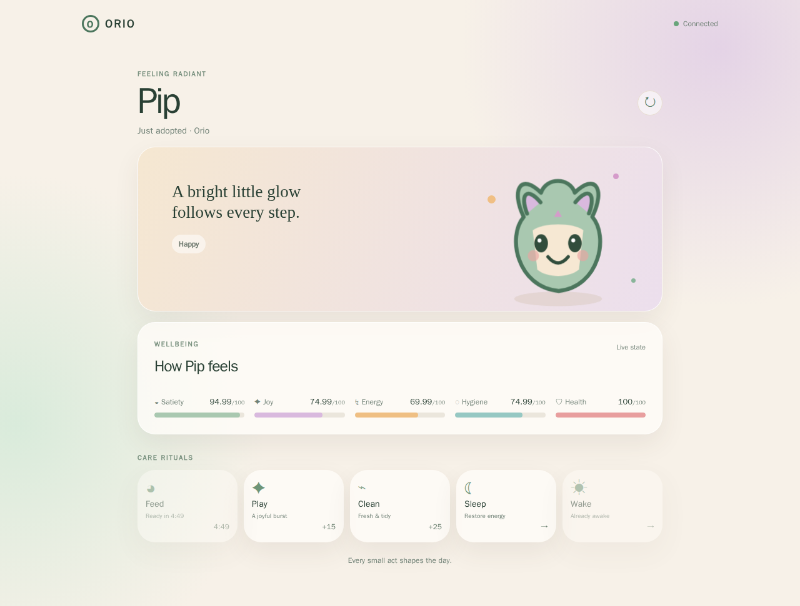
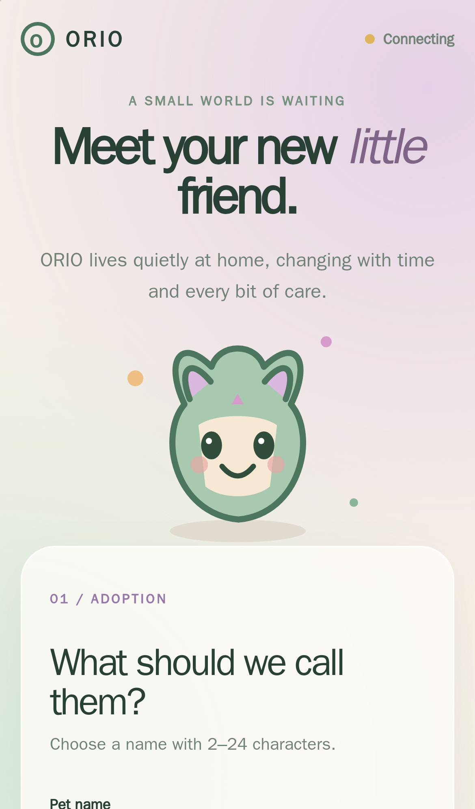

  

<h1 align="center">ORIO</h1>

<strong>Your little world, alive.</strong>

A small private virtual pet that grows slowly at home — one snack, one nap, one joyful moment at a time.

  <a href="docs/DOCKER.md">Run at home</a> · <a href="docs/RASPBERRY_PI.md">Raspberry Pi</a> · <a href="docs/DEVELOPMENT.md">Technical docs</a>

  

  

## A tiny companion, a living rhythm

ORIO is not a feed to scroll or a score to chase. It is a gentle little creature living on your own machine. Adopt it once, give it a name, and its needs continue to change while you are away. Return for a snack, a game, a clean-up, or a well-earned nap.

The soft sage, cream, lilac, and peach world is made around an original animated SVG companion. It breathes, blinks, jumps with joy, dreams, and reacts to how it feels.

## A glimpse of the day

| Care for a little world | Feel its response |
| --- | --- |
| Five changing needs: satiety, joy, energy, hygiene, and health | Happy, hungry, sad, sleepy, and sick expressions |
| Feed, play, clean, sleep, and wake rituals | Progression that continues safely for up to 24 hours offline |
| One private shared pet for one ORIO installation | A responsive installable web app for phone and desktop |

## Made to live at home

ORIO has no accounts and no cloud dependency for gameplay. Its single pet is saved in PostgreSQL on your own host, designed especially for a private Raspberry Pi ARM64 setup. The default Docker configuration only binds the web app to the host loopback interface; connect privately with Tailscale or put it behind an authenticated HTTPS proxy.

## The creature

  

Round ears, a soft leaf-green coat, and a tiny lilac spark: ORIO is a new mascot drawn from scratch for this project.

## What comes next

ORIO is intentionally small today. Future ideas include more species, optional accounts, a garden, collectible keepsakes, gentle mini-games, and notifications — none of these are built into this personal edition yet.

## Make a little world better

Contributions, bug reports, and thoughtful design ideas are welcome. Please start with the [development guide](docs/DEVELOPMENT.md) and keep the calm, private spirit of ORIO intact.

---

For setup, architecture, API, game balancing, containers, Raspberry Pi deployment, and Jenkins automation, visit the [technical documentation](docs/DEVELOPMENT.md).
