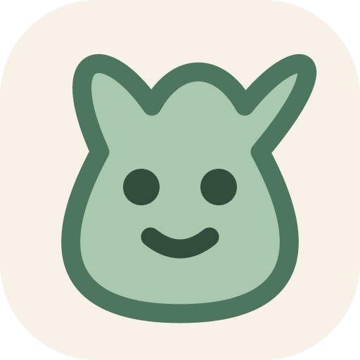

<h1 align="center">ORIO</h1>

<strong>Your little world, alive.</strong>

ORIO is a calm virtual companion for your own server. Every account has a separate pet, authenticated with an Argon2id password and a server-side HttpOnly session. No auth token is stored in the browser.

## Hatch a little world

Your first companion arrives through a mystery egg: give them a name, hatch the egg, and discover the creature selected securely by the server. The outcome is permanent for that account and every species follows the same care, offline progression, and wellbeing rules.

Five original pastel companions live in ORIO: **Orio**, **Rabbit**, **Fox**, **Bear**, and **Chick**. Each has its own hand-drawn SVG mascot, expressions, and gentle reactions for feeding, play, sleep, and everyday moods.

## Play to care

Feed, Play, and Clean are interactive care moments rather than instant rewards. **Snack Catch** rewards fresh food while avoiding spoiled snacks, **Memory Lights** rewards remembered sequences, and **Bubble Bath** rewards every cleaned spot on the adopted companion. The browser renders each game with Angular, CSS, and SVG; NestJS owns the persistent session, validates the reported interactions, calculates the score and reward, and updates the pet only once.

<a href="docs/DOCKER.md">Run with Docker</a> · <a href="docs/RASPBERRY_PI.md">Raspberry Pi</a> · <a href="docs/API.md">API</a>

The Docker configuration supports AMD64 and ARM64, keeps PostgreSQL private behind Caddy, and retains saves in a named volume. Use invite-only registration and HTTPS when exposing ORIO outside your private network.
